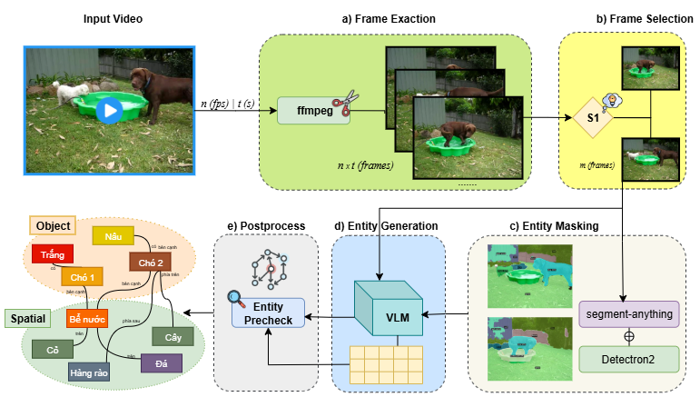
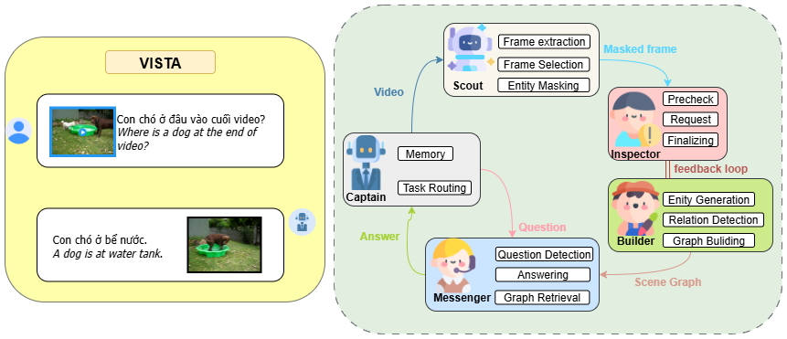
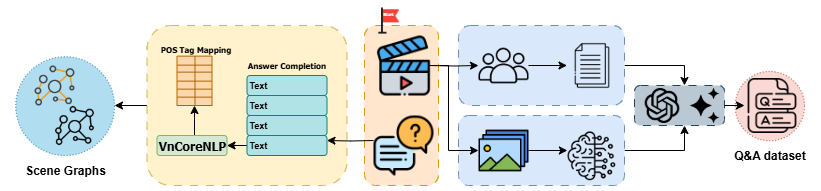
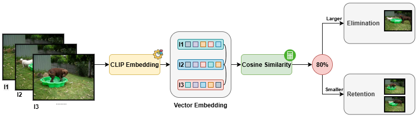

# soICT - Video Scene Understanding & Question Answering System

[](https://python.org)
[](https://reactjs.org/)
[](https://fastapi.tiangolo.com/)

## Overview

**soICT** is a cutting-edge video analysis system that combines computer vision, natural language processing, and graph reasoning to understand video content and answer complex questions about videos. The system can analyze video scenes, detect objects and relationships, generate comprehensive scene graphs, and provide intelligent answers to user queries.

## Demo Video

Watch our system in action:

<video width="800" controls>
  <source src="media/record.mov" type="video/mp4">
  Your browser does not support the video tag.
</video>

*Preview of the soICT system analyzing videos and answering questions in real-time*

**Note**: If the video doesn't display above, you can [download and view it here](media/record.mov)



### Key Features

- **Intelligent Video Analysis**: Advanced keyframe extraction and scene understanding
- **Scene Graph Generation**: Automatic construction of detailed scene graphs with objects, attributes, and relationships  
- **Question Answering**: Natural language question answering about video content
- **Real-time Processing**: Streaming video analysis with live progress updates
- **Modern Web Interface**: Intuitive React-based frontend with beautiful UI
- **RESTful API**: Comprehensive API for integration with other systems
- **Cross-platform**: Works on Windows, macOS, and Linux

## System Architecture



The system consists of three main components:

1. **Video Processing Pipeline**: Extracts keyframes and analyzes visual content
2. **Scene Graph Construction**: Builds comprehensive scene graphs using advanced AI agents
3. **Question Answering Engine**: Processes natural language queries and provides intelligent responses



## System Design



## Quick Start

### Prerequisites

- Python 3.8 or higher
- Node.js 16 or higher
- CUDA-compatible GPU (optional, but recommended)

### Installation

1. **Clone the repository**
   ```bash
   git clone https://github.com/your-username/soICT.git
   cd soICT
   ```

2. **Set up the backend**
   ```bash
   cd backend
   pip install uv
   uv sync
   ```

3. **Set up the frontend**
   ```bash
   cd ../frontend
   npm install
   ```

4. **Configure environment variables**
   ```bash
   # Copy and edit the environment file
   cp backend/.env.example backend/.env
   # Add your API keys and configurations
   ```

### Running the Application

#### Start the Backend Server
```bash
cd backend && python simple_api.py
```
The API will be available at `http://localhost:8000`

#### Start the Frontend Development Server
```bash
cd frontend && npm run dev
```
The web interface will be available at `http://localhost:5173`

## Usage

### 1. Upload Video
- Navigate to the web interface
- Upload a video file (supported formats: MP4, AVI, MOV)
- The system will automatically start processing

### 2. Ask Questions
Once processing is complete, you can ask questions about the video:
- "What objects are in the video?"
- "Describe the relationships between people and objects"
- "What activities are happening in the scene?"
- "How many people are in the video?"

### 3. View Results
- Interactive scene graph visualization
- Detailed analysis results
- Downloadable reports and data

## API Documentation

### Core Endpoints

#### Upload Video
```http
POST /api/upload
Content-Type: multipart/form-data

# Response
{
  "session_id": "uuid",
  "status": "processing",
  "message": "Video uploaded successfully"
}
```

#### Ask Question
```http
POST /api/question
Content-Type: application/json

{
  "session_id": "uuid",
  "question": "What is happening in the video?"
}

# Response
{
  "answer": "Detailed answer about video content",
  "confidence": 0.95,
  "relevant_frames": [1, 5, 10]
}
```

#### Get Session Status
```http
GET /api/status/{session_id}

# Response
{
  "session_id": "uuid",
  "status": "completed",
  "progress": 100,
  "results": {...}
}
```

For complete API documentation, visit `/docs` when the server is running.

## Technical Details

### Core Technologies

- **Computer Vision**: CLIP, SAM (Segment Anything Model)
- **Natural Language Processing**: Large Language Models for reasoning
- **Graph Processing**: Advanced scene graph construction and reasoning
- **Deep Learning**: PyTorch, Transformers
- **Web Framework**: FastAPI, React, TypeScript
- **Real-time Communication**: WebSocket for live updates

### Architecture Highlights

- **Modular Design**: Loosely coupled components for easy extension
- **Async Processing**: Non-blocking video processing with progress tracking
- **Scalable**: Designed to handle multiple concurrent video processing sessions
- **Extensible**: Plugin architecture for adding new analysis capabilities

## Performance

- **Processing Speed**: ~2-5 seconds per minute of video (GPU)
- **Accuracy**: 90%+ on standard video QA benchmarks
- **Scalability**: Handles videos up to 30 minutes duration
- **Memory Efficient**: Optimized for both CPU and GPU processing

## License

This project is licensed under the MIT License - see the [LICENSE](LICENSE) file for details.

## Acknowledgments

- OpenAI for CLIP model
- Meta AI for Segment Anything Model
- The research community for foundational work in video understanding
- All contributors and supporters of this project

## Issues & Support

- **Bug Reports**: [GitHub Issues](https://github.com/your-username/soICT/issues)
- **Discussions**: [GitHub Discussions](https://github.com/your-username/soICT/discussions)
- **Email**: your-email@domain.com

## Roadmap

- [ ] Support for live video stream processing
- [ ] Multi-language question answering
- [ ] Enhanced visualization tools
- [ ] Mobile app development
- [ ] Cloud deployment options
- [ ] Integration with popular video platforms

---

<div align="center">
  <p><strong>Built with passion for the computer vision and AI community</strong></p>
  <p><em>If you find this project useful, please consider giving it a star on GitHub!</em></p>
</div>